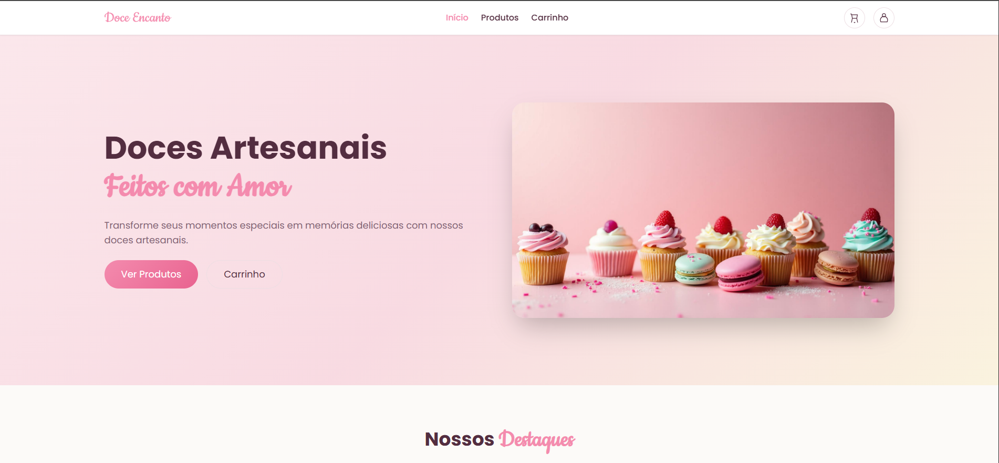
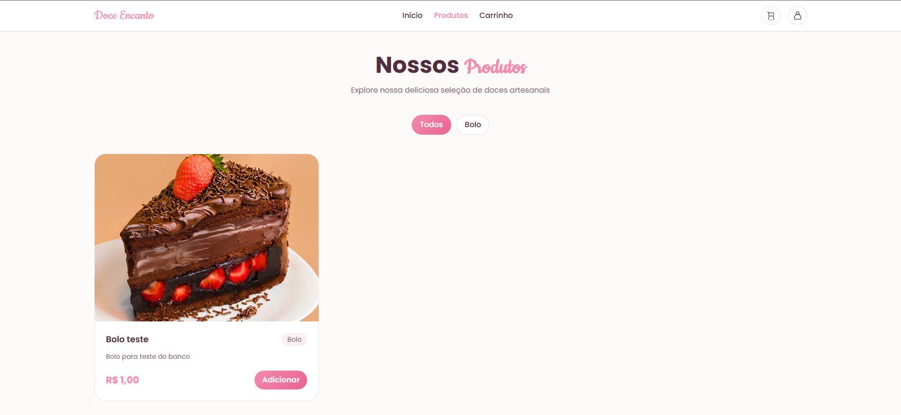
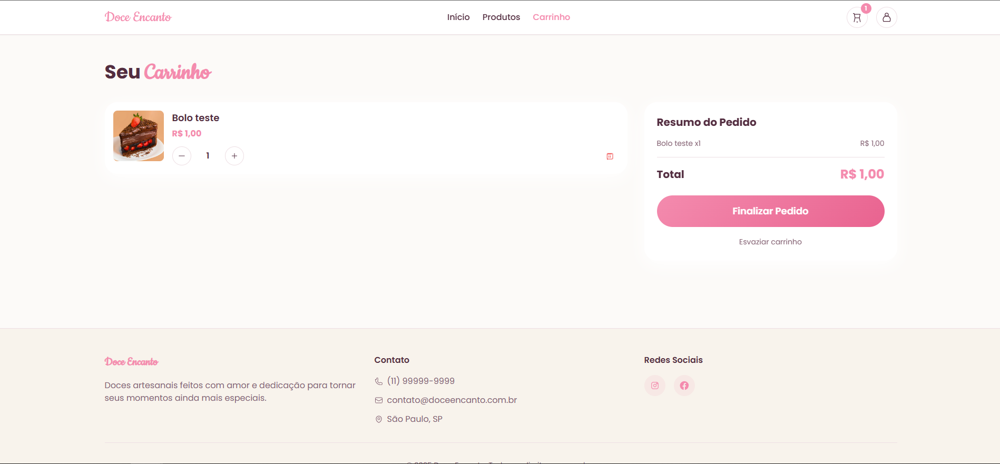
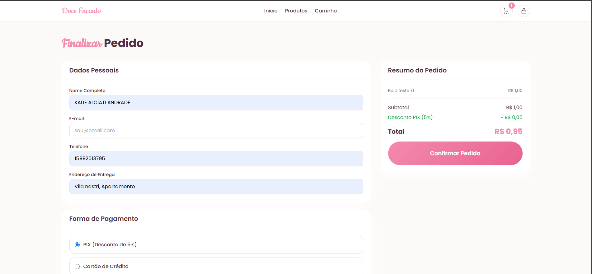
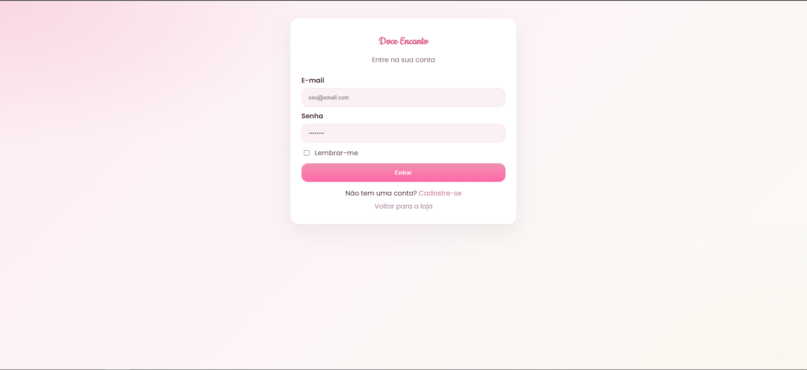
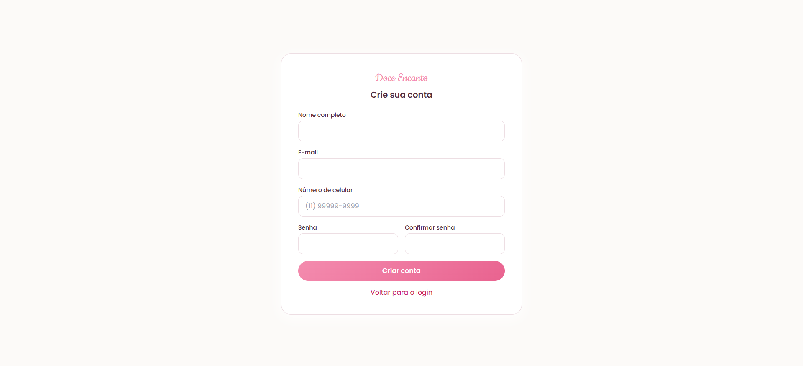
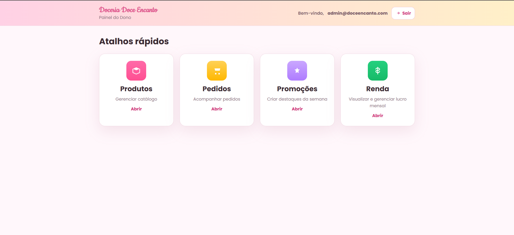

# 🍰 Doce Encanto — Doceria Artesanal

Aplicação web completa desenvolvida em **PHP** com integração ao **Telegram**, simulando um sistema de e-commerce para uma doceria artesanal.  
O projeto possui sistema de produtos, carrinho, checkout, painel administrativo e confirmação automática de pedidos via bot do Telegram.

---

## 🚀 Funcionalidades Principais

- 🧁 Catálogo de produtos dinâmico  
- 🛒 Carrinho com cálculo automático de totais  
- 💳 Pagamento com **PIX (5% de desconto)**, **cartão** ou **dinheiro**  
- 🤖 Envio de confirmação do pedido direto no **Telegram**  
- 📦 Registro de pedidos, promoções e controle de renda  
- 👩‍💻 Painel administrativo completo para gerenciamento da loja  

---

## 🖥️ Telas do Sistema

### 🏠 Página Inicial
<p align="center">
  
</p>

---

### 🧁 Catálogo e Produto
<p align="center">
  
  
</p>

---

### 🧾 Checkout e Confirmação
<p align="center">
  
  
</p>

---

### 💬 Confirmação via Telegram
<p align="center">
  
</p>

---

## 🧭 Área do Dono (Administração)

Gerencie produtos, promoções, pedidos e renda diretamente no painel administrativo.

<p align="center">
  
  
</p>

<p align="center">
  
  
</p>

---

## ⚙️ Tecnologias Utilizadas

- **PHP 8+**
- **TailwindCSS**
- **Telegram Bot API**
- **JSON Storage (simulação de banco de dados)**
- **XAMPP / Apache Localhost**

---

## 💡 Como Testar o Projeto

1. **Clone o repositório:**
   ```bash
   git clone https://github.com/KaueAlciati/pastel-sweet-shop.git
Coloque a pasta em:
C:\xampp\htdocs\
e inicie o Apache pelo XAMPP.

Acesse no navegador:

arduino
Copiar código
http://localhost/pastel-sweet-shop/
Crie um bot no BotFather
e copie o token fornecido.

Edite o arquivo:

bash
Copiar código
includes/telegram.php
e insira:

php
Copiar código
const TG_BOT_TOKEN   = 'SEU_TOKEN_AQUI';
const TG_DEFAULT_CHAT = 'SEU_CHAT_ID_AQUI';
Finalize um pedido no site e clique em
"Receber confirmação no Telegram" ✅

### 📸 Outras Telas
<p align="center">   </p> <p align="center">   </p>
Projeto desenvolvido para fins acadêmicos, simulando uma aplicação real de e-commerce com integração a API externa.
